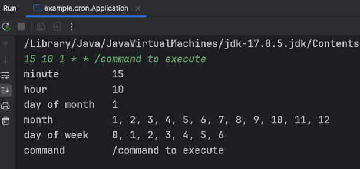

# Cron-Parser

## Overview

**Cron-Parser** is a Java-based utility designed to interpret and validate cron expressions, providing users with the means to parse and check cron schedules. 
This tool is especially useful for developers or anyone who needs to automate tasks based on cron schedules. 
The parser interprets cron syntax and provides feedback on valid or invalid expressions, making it easier to troubleshoot and set up scheduled tasks.

## Features

- **Standard Cron Syntax Support**: Parses standard cron expressions, including ranges, steps, lists, and wildcard characters.
- **Validation**: Validates cron expressions to check their correctness, helping users identify errors.
- **Extensibility**: Modular design allows for easy extension and integration into other applications.
- **Error Handling**: Provides meaningful error messages for invalid expressions, aiding in debugging and correction.

## Installation

### Prerequisites

- **Java 8+**: Ensure Java Development Kit (JDK) 8 or higher is installed.
- **Apache Maven**: Build and dependency management tool.

### Steps

1. **Clone the Repository**:
   ```bash
   git clone https://github.com/dj13may91/cron-parser.git
   ```

2. **Navigate to the Project Directory**:
   ```bash
   cd src
   ```

3. **Build the Project**:
   Use Maven to build the project. This will compile the source code and run any tests:
   ```bash
   mvn clean install
   ```

## Usage

Once the project is built, you can start using the Cron-Parser in your Java applications. 
Below is a basic example that demonstrates how to parse and validate a cron expression.

### Steps for a sample run
1. Run Application.java
2. Enter you cron string followed by command
   Sample string: `15 10 1 * * /command to execute`
3. Output as below:
   

### Cron Syntax Examples
| Expression             | Description        |
|------------------------|--------------------|
| `* * * * * /command`   | Every minute       |
| `*/5 * * * * /command` | Every 5 minutes    |
| `0 12 * * * /command`  | At 12:00 every day |
| `15 10 * * * /command` | At 10:15 every day |


### Running Tests
Ensure JUnit is installed.
Run the tests using Maven or your preferred IDE.

```bash
mvn test
```
